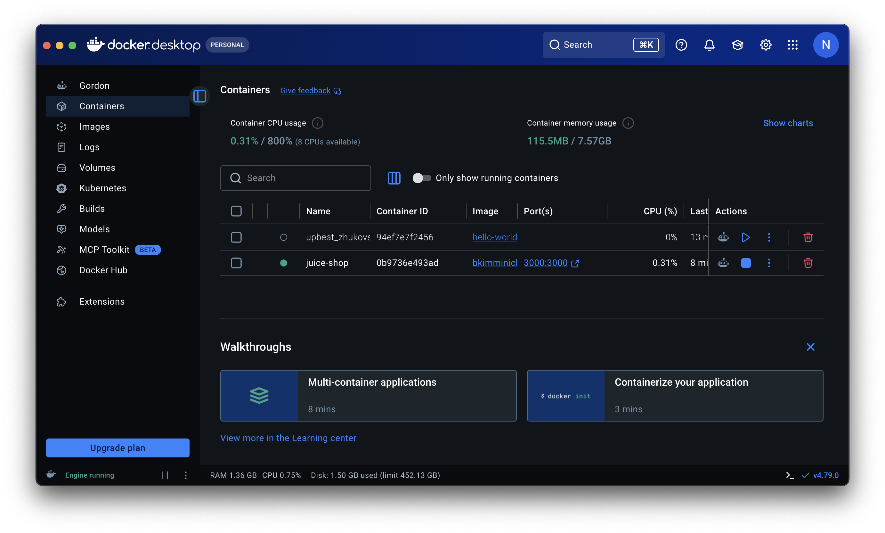
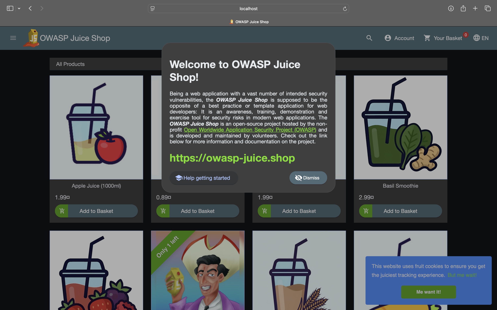
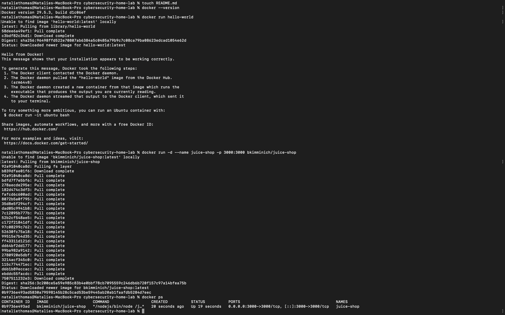

# Cybersecurity Home Lab

## Project Overview

This home lab was built on macOS using Docker Desktop and OWASP Juice Shop.

The goal of this lab is to practice web application security concepts in a safe and legal environment.

## Technologies Used

* Docker Desktop
* OWASP Juice Shop
* macOS
* Terminal
* Git
* GitHub

## Setup Steps

### Pull the Juice Shop Image

```bash
docker pull bkimminich/juice-shop
```

### Run the Container

```bash
docker run -d -p 3000:3000 --name juice-shop bkimminich/juice-shop
```

### Verify Container Status

```bash
docker ps
```

### Access the Application

Open the application in your browser:

```text
http://localhost:3000
```

## Screenshots

### Docker Desktop Running



### OWASP Juice Shop Homepage



### Container Verification



## Skills Demonstrated

* Docker containerization
* Web application deployment
* Linux command-line operations
* Git version control
* GitHub repository management
* Cybersecurity home lab setup
* Basic DevOps workflow
* Technical documentation

## Project Outcomes

* Successfully deployed OWASP Juice Shop using Docker.
* Verified container operation through Docker commands.
* Published the project to GitHub with documentation and screenshots.
* Created a foundation for future web application security testing exercises.

## Future Work

* Complete OWASP Juice Shop challenges.
* Document findings and lessons learned.
* Practice vulnerability discovery and remediation.
* Expand the home lab with additional security tools.
* Add challenge write-ups and screenshots to the findings folder.

This repository will be updated as additional OWASP Juice Shop challenges and cybersecurity exercises are completed.
